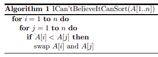

1.  Escriba una función que sume los primeros $n$ números naturales. Compare su desempeño contra la `sum(1:n)`. Utilice el siguiente modelo como base:

    ``` r
    sumar_naturales = function(n) {
      # suma = ...
      return(suma)
    }
    ```

2.  Escriba una función tal que dada una matriz devuelva su parte triangular superior. Utilice el siguiente modelo como base:

    ``` r
    extraer_trisup = function(matriz) {
      # trisup = ...
      return(trisup)
    }
    ```

3.  Un juego consiste en revelar una por una las cartas de un mazo mientras que se repiten los números 1, 2 y 3. Si al revelar la carta coincide con el número cantado, el juego se pierde. Solo se gana si no hay ninguna coincidencia.

    1.  Escriba una función que realice una sola repetición del juego. Utilice el siguiente modelo como base:

        ``` r
        juego_123 = function() {
          # ganamos = ... # logical
          return(ganamos)
        }
        ```

    2.  Luego, juegue $1000$ veces y calcule la proporción de veces que ganó el juego. Utilice bucles y compare el desempeño contra el siguiente código:

        ``` r
        mean(replicate(n=1000, expr=juego_123))
        ```

4.  Diseñe una función que dado un vector numérico devuelva un vector que indique, como texto, a qué decil pertenece cada valor. Por ejemplo, para el vector `num_vec=1:10`, la función debería devolver el vector `c("primer decil", "segundo decil", …, "décimo decil")` . Utilice el siguiente modelo como base:

    ``` r
    indicar_deciles = function(num_vec) {
      # deciles_vec = ...
      return(deciles_vec)
    }
    ```

5.  Arme una función que, dado un vector de valores `logical`, indique si son todos `TRUE`. Compare su desempeño contra la función `all` .

6.  En la primera página de [este](https://arxiv.org/pdf/2110.01111.pdf) trabajo, sus autores proponen un método para ordenar una lista de números de forma creciente. Escriba una función en R que implemente el pseudocódigo de la imagen. ¿Funciona el método propuesto? Compare su desempeño contra la función `sort` .

    
